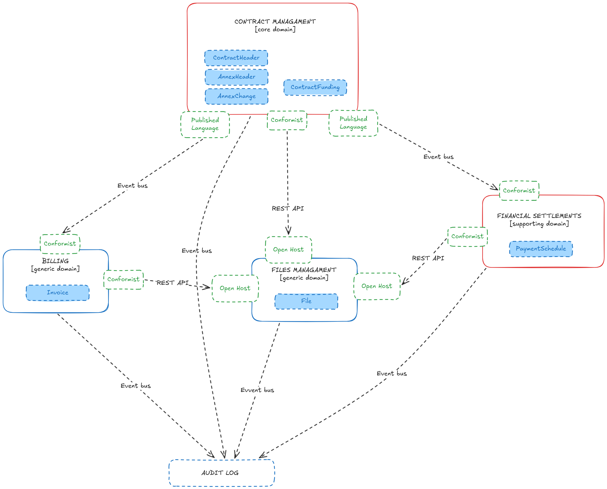

# Domain Discovery and Architecture Design proposal

## Assumptions
Based on log analysis, some of the below assumptions led to further design decisions.

- An annex cannot exist without a contract — it is part of the contract's history, not an independent domain entity.
- `AnnexHeader` is the annex root (describing relation to the contract), `AnnexChange` is the list of specific contract clause modifications within that annex. They are always created together.
- `ContractFunding` remains in the Contract Managament Bounded Context due to its atomic invariant with `ContractFlags`. **Condition for moving it**: if analysis of `ContractFlags` reveals that it does not store funding state, `ContractFunding` should be moved to the Financial Settlements Bounded Context alongside `PaymentSchedule`.
- `PaymentSchedule` is in a separate Financial Settlements Bounded Context. The dependency is one-directional.
- `Invoice` can exist without a contract (`DocumentId` nullable — id 2833, `parent_id: null`). It has its own lifecycle.
- `File` is storage infrastructure — it serves multiple consumers (`FileParentType`: 1=Contract, 2=Annex, 3=Invoice). No domain logic besides its own.
- `EngagementId` on `ContractHeader` suggests the existence of an upstream Sales/CRM system. Not included in current planning, no related events in logs.
- Soft delete is implemented by setting `DeletedDate`, no physically removing records.
- Eventual consistency is acceptable across all inter-bounded context relations.

## Context map

## Bounded Contexts

### Contract Managament (maybe `Lifecycle` would be a better name?)
**Entities:** `ContractHeaderEntity`, `AnnexHeaderEntity`, `AnnexChangeEntity`, `ContractFundingEntity`

#### ContractHeaderEntity

- Aggregate root of the entire BC. **`parent_id: null` always** — not a child of any other entity.
- 1005 events, 1005 correlations. Never `Deleted` — soft delete via `DeletedDate`.
- `ContractFlags` is a bitmask of contract state — it changes atomically with the creation of `ContractFunding` (id 2835–2836–2837, `correlation_id: aa2be7e4`). **This is the key technical reason to keep the Funding in BC for now.** Preferably should be moved to the Financial Settlements BC. 

#### AnnexHeaderEntity and AnnexChangeEntity

- Co-occurrence: AnnexHeader ↔ AnnexChange = **107 cases**, coupling 72–74%. Never appear separately.
- Cascade pattern `[2:1, 3:1] × 77 times` — creating an AnnexHeader always creates an AnnexChange in the same correlation.
- Example: id 2886 (AnnexHeader Added) + id 2887 (AnnexChange Added), `correlation_id: 1345d62f`. `AnnexChange.parent_id` → `AnnexHeader.entity_id`.
- `AnnexHeader.parent_id` → `ContractHeader.entity_id` (id 2903: `ParentId='1f749eee'`, id 2886: `ParentId='360208d2'`). An annex cannot exist without a contract.
- `AnnexChange` is a diff of the contract, not a new entity.

#### ContractFundingEntity

- `parent_id` → `ContractHeader.entity_id` (id 2894: `parent_id='7cc35a84'`, id 2902: `parent_id='7cc35a84'`).
- Fields: `ContractId`, `FundingContractId` (may point to another contract — cross-funding), `Type` (0/1), `Value`, `Name`.
- Cascade pattern `[1:1, 7:1, 7:1] × 3` — a new contract creates two `ContractFunding` records simultaneously.
- Key atomicity evidence: id 2835 (`ContractFlags: 0→7`) + id 2836 + id 2837 (two ContractFunding Added), all within `correlation_id: aa2be7e4`. `ContractFlags` must change atomically with Funding.

> **ContractFunding in Contract BC (and not in Financial Settlements) reasoning**
>
> `ContractFlags` on `ContractHeader` changes atomically with the creation of `ContractFunding` (`correlation_id: aa2be7e4`). If Funding were in a separate BC, maintaining this consistency would require a distributed transaction or a Saga just to keep a flag on the contract in sync.

> **AnnexHeader/Change in Contract BC and not separate reasoning**
>
> An annex is part of the contract's history — `AnnexChange` is a diff of `ContractHeader` fields. Co-occurence of 72–74% and the `[2:1, 3:1] × 77` pattern indicate tight coupling. The zero co-occurrence of `ContractHeader` ↔ `AnnexHeader` reflects the business flow — an annex is always created after a contract.

### Financial Settlements — supporting domain

**Entities:** `PaymentScheduleEntity`

- `parent_id` → `ContractHeader.entity_id`
- `DocumentId` = `contract_id` — the schedule belongs to the contract.
- Co-occurrence with ContractHeader: 73 cases. Cascade pattern **`[1:3, 6:1] × 15`**.
- Added + Deleted + Modified — full, independent lifecycle.
- `PaymentSchedule` and `ContractFunding` modified together: pattern `[6:2, 7:2]` — the schedule reflects funding sources. This correlation is an argument for merging it in one Financial Settlements BC when the `ContractFlags` condition is met.

> **PaymentSchedule separate from Contract BC reasoning**
>
> The dependency is one-directional — the contract has no knowledge of the schedule. The cascade pattern `[1:3, 6:1]` is a reaction to a contract change, not an atomic operation. Eventual consistency is acceptable.

### Billing - generic subdomain

**Entities:** `InvoiceEntity`

- Invoice can exist without a contract.
- Independent lifecycle.
- Low co-occurrence with ContractHeader: `[7/1005]`.

### Files — generic subdomain / infrastructure

**Entities:** `FileEntity`

- **`FileParentType`: 1 = Contract, 2 = Annex, 3 = Invoice**. Serves multiple consumers — the definition of an Open Host Service.
- Examples: id 2898 (`FileParentType=1`, contract), id 2905 (`FileParentType=2`, annex), id 2900 (`FileParentType=3`, invoice).
- No domain logic of its own — File has no ubiquitous language, it is pure storage.
- Soft delete via `DeletedDate` (id 2901: `DeletedDate: null → timestamp`).

## Bounded Contexts Relations
### Contract Lifecycle → Financial Settlements

> Published Language (Contract) → Conformist (Financial Settlements)

- Communication: async - event bus
- Events: `ContractCreated`, `ContractModified`
- ACL: Not required — PaymentSchedule has no rich domain model to protect

Contract BC has no knowledge of `PaymentSchedule`. Financial Settlements subscribes to events and independently updates the schedule. Eventual consistency is acceptable.

### Contract Lifecycle → Billing

> Published Language (Contract) / Conformist (Billing)

- Communication: Async — event bus
- Events: `ContractCreated`, `ContractModified`, `ContractActivated`
- ACL: Not required at this stage — Billing is a generic subdomain

### Contract Lifecycle → Files Management (as a consumer)

> Conformist (Contract) / Open Host Service + Published Language (File)

- Communication: sync REST on file upload (user waits for confirmation)

### Audit Log — no domain relationship

> No pattern — Audit Log is not a domain context, just infrastructure
 
- Communication | Async — event bus
- Audit Log is not a Bounded Context. It is a passive observer that persists all events from the system.

## Audit Log Architecture

Proposed solution: Message bus as Durable Event Log + Audit Log Service as Passive Consumer to all topics.

- Each BC publishes domain events to a dedicated topic. `correlation_id` is propagated to folowing events (analogous to a trace ID in OpenTelemetry tracing).
- Audit Log is raw data. Projections are built independently for specific use cases, highly probable with ready to use tools (Elasticsearch, Databricks, ets)

## Handling the Lack of ACID (Annex saved, Payment schedule save failed example)

Proposed solution: Saga pattern - compensation event.

- `PaymentScheduleUpdateFailed` is published by `Financial Settlements`.
- `Contract Managements` consumes the event and executes compensaton: soft-deletes of the annex.
- `Audit log` consumes all events, under the same `correlation_id`.
- Alerting system may be added for manual retries. 
